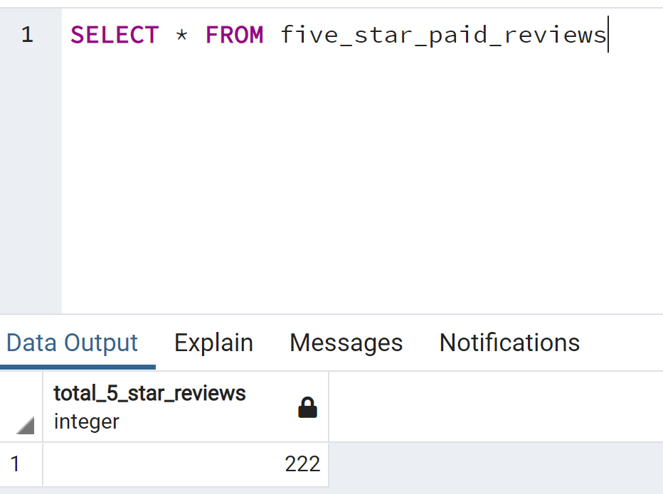

# Overview of the analysis

- In this project, I have access to approximately 50 datasets and choose one. Each one contains reviews of a specific product, from clothing apparel to wireless products. With the dataset I choose I use PySpark to perform the ETL process to extract the dataset, transform the data, connect to an AWS RDS instance, and load the transformed data into pgAdmin. Next, I used SQL to determine if there is any bias toward favorable reviews from Vine members in your dataset. 

# Results 

- Vine reviews

- non-Vine reviews

- Vine reviews with 5 stars 

- Vine reviews with 5 stars percentage 

- non-Vine reviews with 5 stars	

- non-Vine reviews with 5 stars percentage 

# Summary

- 36% of the reviews in the Vine program were 5 stars reviews, however, the percentage in the non-Vine reviews is 47%. This describes a negative bias for reviews in the Vine program.
Additionally, we could analyse the mean, median and mode of the star rating for the Vine and non-Vine reviews.
